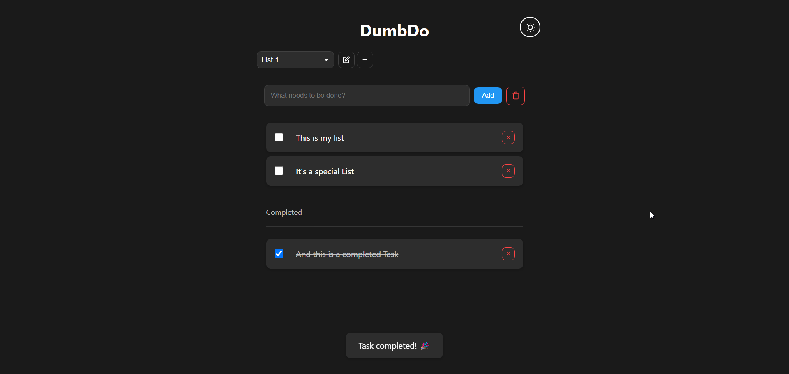

<!--
Este archivo README esta generado automaticamente<https://github.com/YunoHost/apps/tree/master/tools/readme_generator>
No se debe editar a mano.
-->

# DumbDo para Yunohost

[](https://ci-apps.yunohost.org/ci/apps/dumbdo/)


[](https://install-app.yunohost.org/?app=dumbdo)

*[Leer este README en otros idiomas.](./ALL_README.md)*

> *Este paquete le permite instalarDumbDo rapidamente y simplement en un servidor YunoHost.*  
> *Si no tiene YunoHost, visita [the guide](https://yunohost.org/install) para aprender como instalarla.*

## Descripción general

A stupidly simple todo list application that just works. No complex database, no unnecessary features - just todos.

### Features

- Clean, minimal interface
- Dark/Light mode with system preference detection
- File-based storage - todos persist between sessions
- Fully responsive design
- Fast and lightweight
- PIN protection (4-10 digits if enabled)


**Versión actual:** 1.0.0~ynh1

## Capturas



## Documentaciones y recursos

- Sitio web oficial: <https://www.dumbware.io/>
- Repositorio del código fuente oficial de la aplicación : <https://github.com/DumbWareio/DumbDo>
- Catálogo YunoHost: <https://apps.yunohost.org/app/dumbdo>
- Reportar un error: <https://github.com/YunoHost-Apps/dumbdo_ynh/issues>

## Información para desarrolladores

Por favor enviar sus correcciones a la [rama `testing`](https://github.com/YunoHost-Apps/dumbdo_ynh/tree/testing).

Para probar la rama `testing`, sigue asÍ:

```bash
sudo yunohost app install https://github.com/YunoHost-Apps/dumbdo_ynh/tree/testing --debug
o
sudo yunohost app upgrade dumbdo -u https://github.com/YunoHost-Apps/dumbdo_ynh/tree/testing --debug
```

**Mas informaciones sobre el empaquetado de aplicaciones:** <https://yunohost.org/packaging_apps>
